# IGI Editor

**IGI Editor** is a professional 3D world and object manipulation toolkit for Project IGI. Inspired by the original IGI 2 editor, it provides a modern interface for level research, object placement, and terrain modification.

**Current Status: Version 1.0.0 (Official First Public Release)** - Premium 3D modding suite featuring dynamic 3D terrain rendering, spline waypoint layouts, advanced flight camera navigation, full AI behavior customization, and visual task objective management. Supports editing and compiling for all 14 original game levels (with the first 3 levels fully tested and verified).

This project is built upon the foundational work of the [Project-IGI-Terrain](https://github.com/hjcminus/Project-IGI-Terrain) repository. Special thanks to [hjcminus](https://github.com/hjcminus) for their research and for bringing this codebase to light. It is built using C++17 and OpenGL, and it is cross-platform, but it is mainly tested on Windows.

Written and maintained by **Jones-HM (Heaven)**.

---

## 📋 [Changelogs](CHANGELOGS.md)

See the [CHANGELOGS.md](CHANGELOGS.md) for version history and detailed change logs.

---

## 🚀 Features

- **3D Terrain Rendering & Sculpting**: Fully rendered real-time 3D terrain with active snapping, grid drawing, and heightmap editing brushes.
- **Flight Camera & 3D Navigation**: Full 6-DOF fly cam with fine-grained pageup/pagedown speed controls and teleportation tools.
- **Visual Task Tree Editor**: Visual tree-view workspace for managing mission objectives, inserting new tasks (`Task_New`), duplicating nodes, copying/pasting selections, deleting nodes, and multi-step **Undo/Redo** support.
- **Advanced Splines & Waypoints**: Complete spline system for procedural railway paths, mesh repeats, linear/curved segment configuration, and pathing lines.
- **AI Behavior & Mission Layout**: Edit NPC soldier structures, patrol nodes, custom scripts, weapon loadouts, ammunition inventory, and team layouts.
- **Live Editor Real-Time Sync**: Direct communication between the editor and the IGI engine for instant visual and physical feedback.
- **3D Object Placement & Manipulation**: Advanced 6-DOF controls for placing buildings, props, terminals, doors, cameras, and actors.
- **IGI 2 Style Controls**: Seamless object translation and rotation using standard mouse-drag modifiers (Shift, Ctrl, A, B, G).
- **Automated Path & Sync Pipeline**: Automatically handles compiler syncing, path mapping, and safe directory cleaning.

### Current Testing Status
- **Building Editor**: Working - fully tested with Building objects.
- **Terrain Editor**: Working - 3D terrain heightmap rendering and snapping fully functional.
- **Task Tree & Objectives**: Working - interactive tree management, copy/paste, deletion, and insertion of new tasks fully operational.
- **AI & Waypoint System**: Working - full editing of NPC patrol nodes and properties.
- **Model Format**: Currently using **GLB (binary glTF)** format where textures and models are combined for optimal performance in OpenGL.
- **Level Tested**: Supports compiling/decompiling all 14 original game levels. Note that only the first few levels are fully tested and verified. Levels from Level 5 onwards may have bugs or issues; if you find any, please create an issue on GitHub and report them to us! Thank you!

### ⚠️ Known Issues
- **Fence Wire**: Rendering and placement of secondary fence wiring is currently not solved.
- **Complex Splines**: Some highly intricate spline geometries are still work-in-progress and may exhibit artifacts.

### Future Work
- **Mef Parser**: Developing a native parser for proprietary `.mef` model files.
- **Expanded Sandbox Modding**: Expanding item drop coordinates, trigger boundary visualizers, and ammo boxes placements.
- **Full Campaign Testing**: Continuing rigorous end-to-end testing across levels 4 through 14.

## 📸 Screenshots

With the release of our premium modding features, we have expanded our workspace visualization with high-fidelity telemetry, dynamic objective tree views, and comprehensive level environment rendering. 

### 🖥️ Main Editor & Navigation

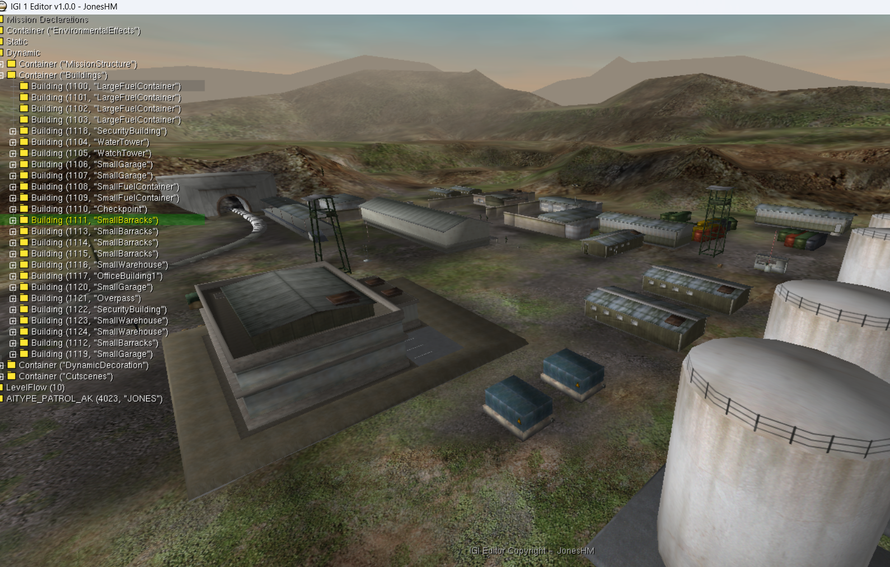
*3D viewport showing level models, objects, and real-time navigation.*

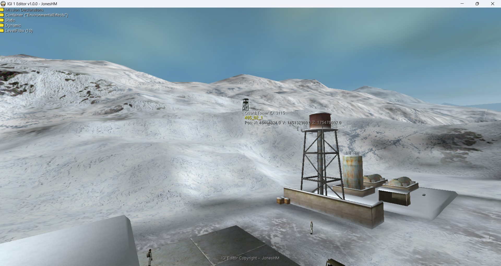
*Level 8 Harbor terrain, dynamic structures, and Flight Camera visualization.*

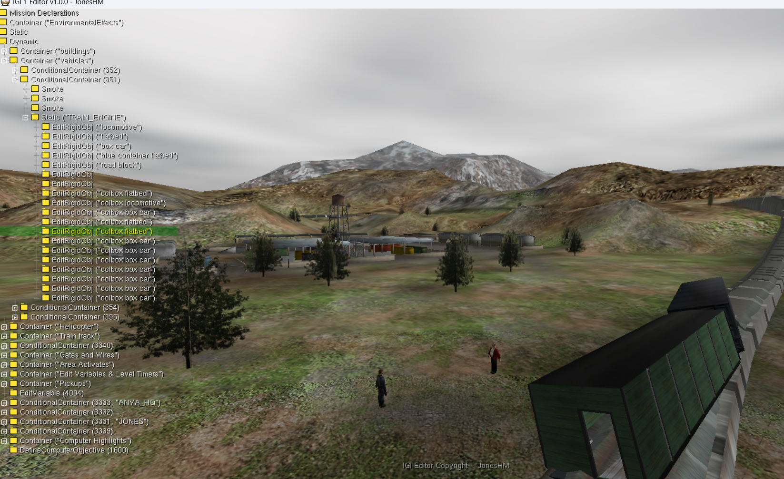
*Level 10 Research Facility rendering, building placement, and real-time snapping.*

### 🌳 Task & Objective Editor

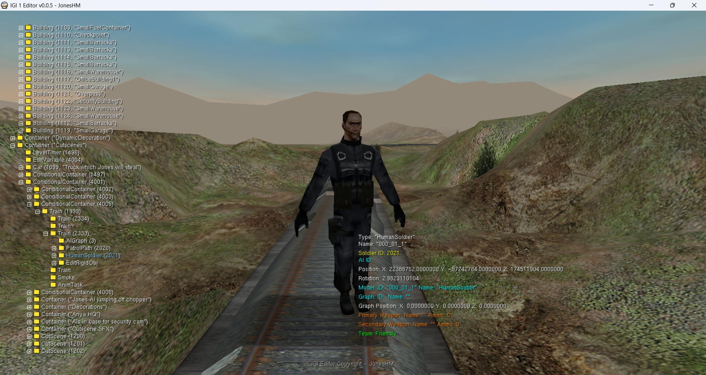
*Visual Task Tree Editor for mission objective management.*

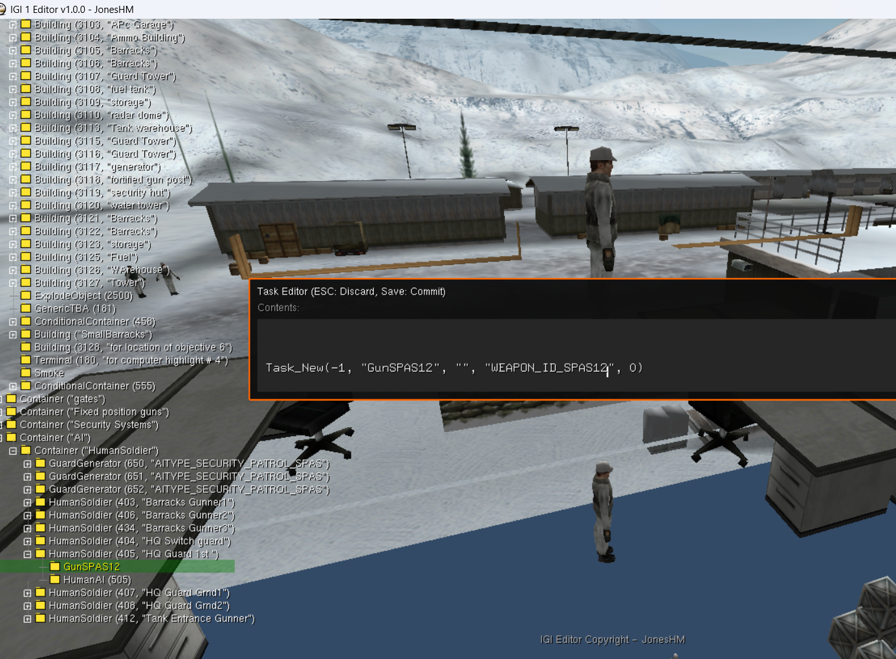
*Interactive Task Objective Editor modal for inline task renaming, notes updates, and direct live save/reload functionality.*

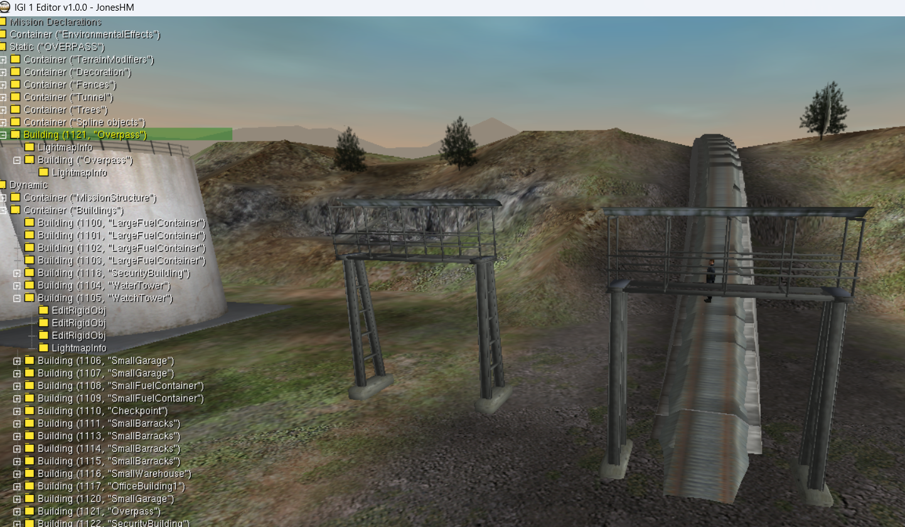
*Task Copy & Paste feature where you can copy and paste any task to replicate any objects with its object tree.*

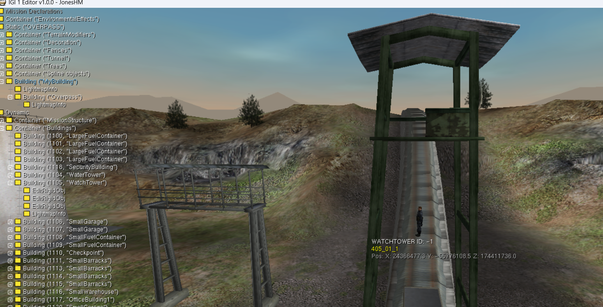
*Adding a new task allows you to easily inject custom new Objects, Buildings, or AI units directly into the level.*

### 🏔️ Terrain Editor

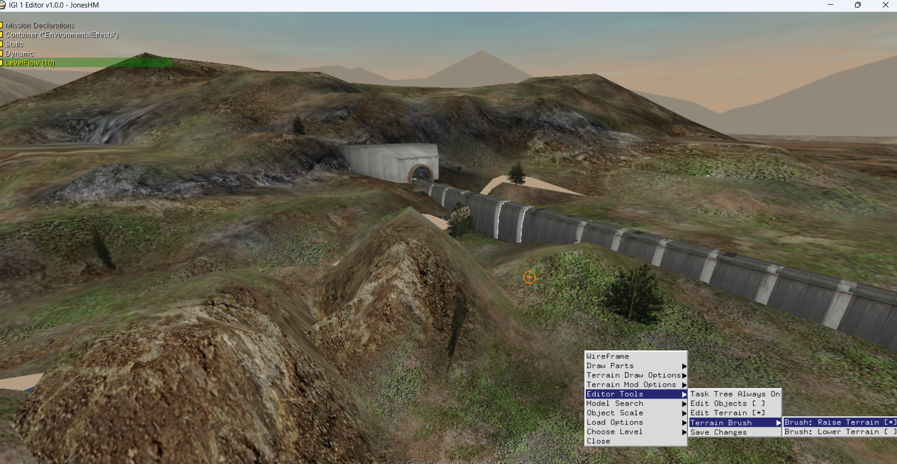
*Interactive 3D Terrain Editor showing terrain sculpting, heightmap editing, and active wireframe brush.*

### 📦 Object & Controls Editor

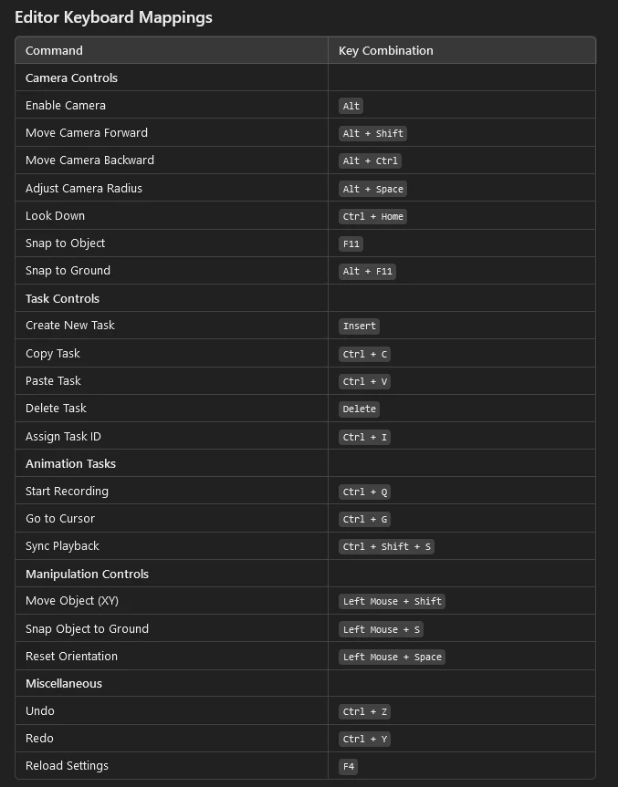
*HUD telemetry displaying precise translation, rotation, and selection info.*

### 🤖 AI Editor

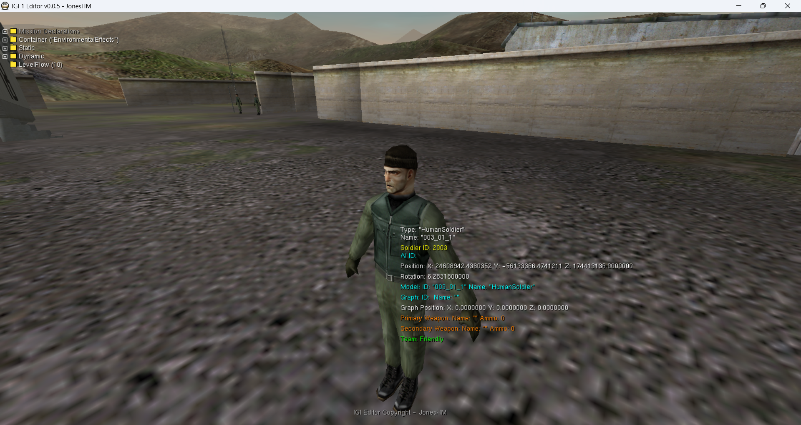
*AI Unit identification and management interface.*

### ⚙️ Debugging & Compilation

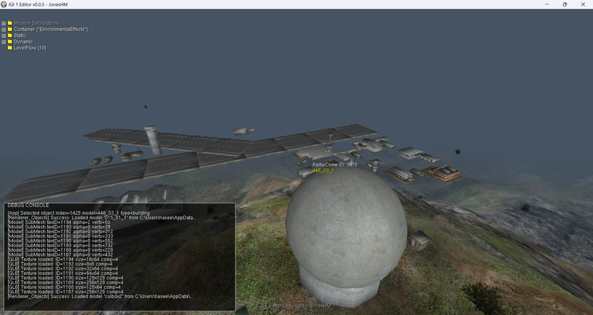
*Debug Console showing IGIPath resolution and QVM compilation pipeline.*

---
 
## Folder Structure

### QEditor AppData Structure (`%APPDATA%/QEditor/`)

The editor requires QEditor to be installed in AppData for QSC/QVM compilation and decompilation:

- **`QFiles/IGI_QSC/`**: Original IGI level data (CTR, CMD, HMP, QSC scripts) organized by:
  - `missions/location0/level[1-14]/` - Level-specific scripts, AI, sounds, terrain
  - `ammo/`, `weapons/`, `common/` - Shared game data
- **`QFiles/IGI_QVM/`**: Compiled QVM files for all levels
- **`QCompiler/`**: Compilation tools (Compile, Decompile, DConv, GConv, TexConv, etc.)
- **`3DEditor/objects/level[1-14]/`**: Level-specific 3D model storage (GLB format with built-in textures, `.obj`, `.mef`)
- **`3DEditor/buildings/level[1-14]/`**: Building model storage (GLB format with built-in textures)
- **`AIFiles/`**: AI data (AI-Json, AI-Path, AI-Script) per level
- **`QGraphs/`**: Area and graph data for levels
- **`QMissions/`**: Mission configuration files
- **`QWeapons/`**: Weapon group and modification data

### Local Repository Folders
- **`shaders/`**: Core OpenGL GLSL shader source files
- **`bin/`**: Pre-compiled binaries and required dynamic libraries (DLLs)
- **`assets/`**: Editor assets (screenshots, icons)

## 🛠️ Future Roadmap

With the successful release of **Version 1.0.0**, core features like the **Task Tree Editor**, **Terrain Editing**, **Splines**, and **AI waypoint management** have been fully realized. Future milestones include:
- **Visual 3D Graph Editor (Coming Soon)**: A full-featured Visual 3D Graph Editor displaying interactive nodes and visuals to seamlessly construct game logic, path routes, and area connections.
- **Proprietary MEF Parser**: Direct support for loading proprietary `.mef` model meshes natively.
- **Weapon & Item Configurator**: Rich telemetry overlays and visual UI for modifying active gun parameters, ammunition slots, and dropping custom inventory directly onto the battlefield.
- **Full 14 Levels campaign run**: Complete, verified playthroughs of all custom compiled maps to guarantee total end-to-end stability.

---

## 💻 Getting Started

### Prerequisites
- **OS**: Windows (x64)
- **Compiler**: MSVC (Visual Studio 2022 recommended)
- **Build System**: CMake
- **QEditor**: Required for QSC/QVM compilation and decompilation.
- **IGI Game**: Full installation of Project IGI required for level data and assets

### Build Instructions
1. Clone the repository.
2. Open the directory in a terminal.
3. Run the following commands:
   ```powershell
   cmake -B build -S .
   cmake --build build --config Release
   ```
4. Launch the editor:
   ```powershell
   .\bin\Release\igi-editor.exe -level 1 -draw_parts 49 -stick_to_ground
   ```

---

## 🔄 How It Works

### Editor Flow

* Editor first copies terrain files from QEditor folder to the executable directory
* Then it finds the latest objects file (QSC or QVM) by checking timestamps across multiple locations (editor, QEditor, IGI game)
* If QVM is newest, it decompiles it to QSC; if QSC is newest, it copies and compiles to QVM to keep everything in sync
* Editor loads the QSC file and parses level data including object positions, rotations, and model references
* Then it loads the terrain heightmap, textures, and lightmaps for rendering and editing
* Next, it loads all 3D models (buildings and props in GLB format with built-in textures) and positions them according to QSC data
* Objects are automatically snapped to the terrain surface to ensure correct placement
* Camera is positioned at the level start coordinates and editor is ready for editing
* When you save changes, the editor writes to objects.qsc, compiles it to objects.qvm, and copies it to the IGI game path

---

## ⌨️ Controls

### Navigation
| Key | Action |
| :--- | :--- |
| **W/S/A/D** | Movement (Forward/Backward/Left/Right) |
| **Q/Z** | Vertical Movement (Up/Down) |
| **F4** | Toggle Edit Cursor (Global Edit Mode) |
| **F3** | Toggle Collision / Clipping |
| **F2** | Toggle Terrain Painting Mode |
| **PageUp/Dn** | Adjust Movement Speed |

### Object Manipulation (IGI 2 Style)
Select an object in **Edit Mode (F4)** and use **LMB Drag** + Modifiers:
- **Shift**: Move on XY Plane
- **Ctrl**: Move on XZ Plane
- **A / B / G**: Rotate Alpha / Beta / Gamma axes
- **S**: Snap to Ground
- **Space**: Reset Orientation
- **F11**: Teleport camera to selected object

---

## 📞 Connect with us

If you encounter any issues or have suggestions, feel free to reach out:

- **🎮 Discord**: Message me at `Jones_IGI#3954` or join our [Discord Server](https://discord.com/invite/QpbQrRFAER).
- **📧 Email**: [igiproz.hm@gmail.com](mailto:igiproz.hm@gmail.com)
- **🌟 GitHub**: Follow the project on [Jones-HM GitHub](https://github.com/Jones-HM/).
- **📺 YouTube**: Subscribe to [IGI Research Devs](https://www.youtube.com/@igi-research-devs) for guides and walkthroughs.

---

## 🏆 Credits and Contributors

If you want to use this data, respect fellow researchers and give proper credits to people. (давать людям должные кредиты)

- **[Yoejin Light](https://vk.com/id436486682)** 🌟 - _MTP, Models structure_ and information.
- **[Dimon Krevedko](https://vk.com/dimonkrevedko)** 🌟 - **Graphs and Nodes** structure and information.
- **[Artiom Rotari](https://github.com/NEWME0)** 🌟 - _DConv Tools for Decompiler_ and **Scripts**.
- **[ORWA S](https://www.youtube.com/@totalwartimelapses6359)** 🌟 - **Graphs Area and Nodes** compilation of information.
- **[GM123](https://www.youtube.com/@gm1233)** 🌟 - **Detailed Models Information**.
- **[Dark](https://www.youtube.com/@CRONOQUILLOFFICIAL)** 🌟 - **Contributed on Various Projects and files (Resources, QVM, QSC etc) and UI/UX Designs**.
- **[Ferit Coder](https://www.youtube.com/channel/UCpn_gZMkFVBUAe9SJK9hYQA)** 🌟 - **Helped with IGI 2 ToolKit Maps/Models conversion to IGI 1**.
- **[Neo](https://next.nexusmods.com/profile/xaeroneo?gameId=5664)** 🌟 - **Helped with all 3D Models/Textures of all Objects/AI without that would not have been possible to create this.**

---

### Acknowledgments
Special thanks to the original authors and researchers:
- [hjcminus](https://github.com/hjcminus) - 3D Terrain Editor Project, which this project is based on.
- [mrmaller1905](https://github.com/mrmaller1905) - For Requesting this feature.
