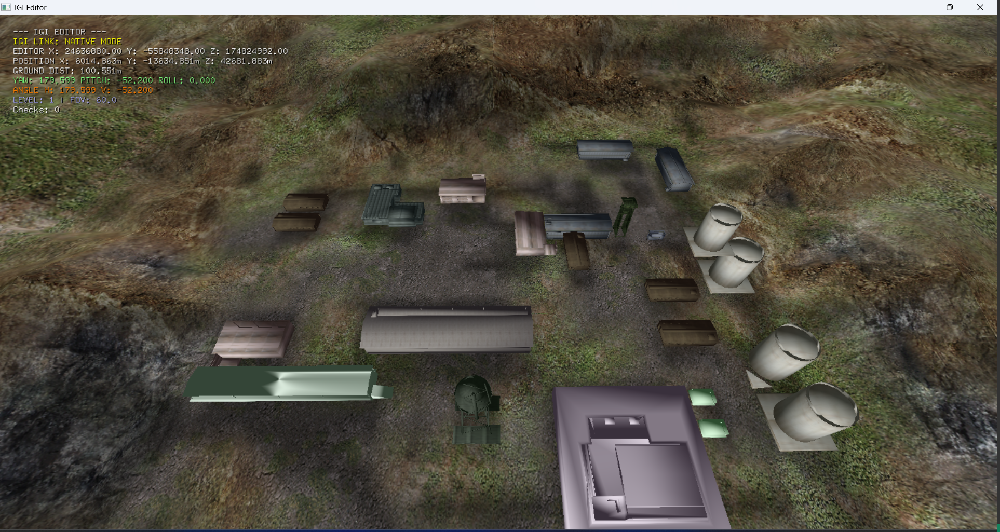

# Brief

**IGI 3D Editor** - A modern 3D terrain and object editor for IGI game levels, inspired by the original IGI Editor.

This project is the result of analysis decompiled IGI.exe c code from IDA Pro 7.9.  

It use OpenGL as rendering API.  
Use shaders to replace old Direct3D7 fixed function pipeline.  
Use glut as application framework  
and migrate from x86 to x64 platform.

## Features

- **3D Terrain Editing**: Modify terrain height maps with raise/lower brushes
- **3D Object Loading**: Load and render OBJ 3D models in the editor
- **Cube Transform Flags**: Apply 8 different transform flags (rotation/flip) to terrain cubes
- **Real-time Rendering**: OpenGL-based shader rendering with wireframe overlay
- **Level Navigation**: Load and navigate through all 13 IGI game levels
- **Editor Mode**: Toggle edit mode for terrain modification
- **Original IGI Compatibility**: Uses same coordinate system and file formats as original IGI

# Folder structure

├─ bin/				&emsp;&emsp;&emsp;&emsp;test program output binaries  
├─ build/			&emsp;&emsp;&emsp;build directory (cmake)  
├─ res/				&emsp;&emsp;&emsp;&emsp;test levels (1~13)  
├─ shaders/			&emsp;&emsp;&emsp;OpenGL shader files  
│  ├─ 4.1/			&emsp;&emsp;&emsp;GLSL 4.1   
│  └─ 4.5/			&emsp;&emsp;&emsp;GLSL 4.5   
├─ source/			&emsp;&emsp;&emsp;c++ source code   
└─ third_party/		&emsp;&emsp;external libraries   

# How to build

Note: Only tested on x64 platform.

## Build on windows

Execute these commands or just run make.bat  

&gt; mkdir vcbuild  
&gt; cd vcbuild  
&gt; cmake ..  

This will generate igi_terrain.sln (or igi_terrain.xsln for msvc2026) in vcbuild folder.

## Build on ubuntu

You need to install glut, glew development packages.  

$ sudo apt install freeglut3-dev  
$ sudo apt install libglew-dev  

build:  

$ mkdir build  
$ cd build  
$ cmake ..  
$ make  

The output binary file will write to bin folder.

# Command line options:

| Option                           | Description                       |
|:---------------------------------|:----------------------------------|
| -w &lt;width&gt;                 | Set start window width            |
| -h &lt;height&gt;                | Set start window height           |
| -wireframe                       | Init wireframe mode               |
| -draw_parts &lt;flags&gt;        | Init draw parts                   |
| -draw_terrain_opts &lt;flags&gt; | Init draw terrain options         |
| -terrain_mod_opts &lt;flags&gt;  | Init terrain modification options |
| -level &lt;level_no: 1~13&gt;    | Set start level                   |
| -yaw   &lt;degree&gt;            | Set viewer start yaw              |
| -pitch &lt;degree: -89~89&gt;    | Set viewer start pitch            |
| -stick_to_ground                | Snap all objects to terrain height |

### Render Mode (`-draw_parts`) Flags:

You can combine these values to render multiple parts (e.g., `-draw_parts 49` for Everything).

| Render Mode | Flag Value | Command Example |
| :--- | :--- | :--- |
| **Only 3D Buildings** | `16` | `.\bin\Release\igi-editor.exe -level 1 -draw_parts 16` |
| **Only Rigid Objects (Props)** | `32` | `.\bin\Release\igi-editor.exe -level 1 -draw_parts 32` |
| **Both Buildings & Objects** | `48` | `.\bin\Release\igi-editor.exe -level 1 -draw_parts 48` |
| **Buildings + Terrain** | `17` | `.\bin\Release\igi-editor.exe -level 1 -draw_parts 17` |
| **Props + Terrain** | `33` | `.\bin\Release\igi-editor.exe -level 1 -draw_parts 33` |
| **Everything (Both + Terrain)** | `49` | `.\bin\Release\igi-editor.exe -level 1 -draw_parts 49` |
| **Legacy Mode (All Objects)** | `5` | `.\bin\Release\igi-editor.exe -level 1 -draw_parts 5` |

# Input

## keyboard

| Key       | Description                                             |
|:----------|:--------------------------------------------------------|
| Alt+Enter | Toggle windowed / full-screen mode                       |
| F2        | Toggle overlay a wireframe mesh on top of solid surface |
| F3        | Toggle clipping                                         |
| F4        | Show / hide cursor                                      |
| Page Up   | Twice the movement speed                                |
| Page Down | Half the movement speed                                 |
| Left      | Decrease Roll                                           |
| Right     | Increase Roll                                           |
| w         | Move forward                                            |
| s         | Move backward                                           |
| a         | Move left                                               |
| d         | Move right                                              |
| q         | Move straight up                                        |
| z         | Move straight down                                      |
| space key | Jump if clip mode turned on (F3 key)                    |

## Editor Controls

### 3D Object Loading

The editor supports loading OBJ 3D models for visualization and placement:

- Place OBJ files in the project directory  
- Models are automatically loaded on startup
- Press 'R' in edit mode to cycle through cube transform flags (0-7)
- Click on terrain to apply transforms

### Transform Flags

| Flag | Description |
|------|-------------|
| 0 | No change |
| 1 | Rotate 90° CCW around Z axis |
| 2 | Rotate 180° CCW around Z axis |
| 3 | Rotate -90° CCW around Z axis |
| 4 | Flip along YOZ plane |
| 5 | Flip YOZ + rotate 90° CCW |
| 6 | Flip YOZ + rotate 180° CCW |
| 7 | Flip YOZ + rotate -90° CCW |

## Context Menu

(*)	radio option  
[+] flag set	 
[-] flag unset

| Sub menu             | Description                                                      |
|:-------------------- |:-----------------------------------------------------------------|
| Wireframe            | Toggle overlay a wireframe mesh on top of solid surface          |
| Draw Parts           | Toggle draw skydome / flat sky layer / terrain                   |
| Terrain Draw Options | Toggle draw tiled texture / light map / fog                      |
| Terrain Mod Options  | Toggle apply texture modifier / height map / discards            |
| Choose Level         | Choose level: 1 ~ 13                                             |
| Close                | Quit application                                                 |

### "Terrain Draw Options" sub menu

| Menu Item | Description                                  |
|:----------|:---------------------------------------------|
| Texture   | Toggle draw tiled material textures          |
| Light Map | Toggle overlay baked shadow map onto terrain |
| Fog       | Toggle fog                                   |

### "Terrain Mod Options" sub menu

| Menu Item        | Description                                                      |
|:-----------------|:-----------------------------------------------------------------|
| Texture Modifier | Toggle apply texture modifier (at most 4 tiled material textures can be combined together. e.g. grass, rock, dust) |
| Height Map       | Adjust height value of specific area (bilinear interpolated), make it flat or bumpy. |
| Discard Terrain  | Some buildings has underground part, to avoid player clipped by terrain mesh, the cube which contain the building need be discarded. |

# File Types

## Common file types

| File type | Description                                                      |
|:----------|:-----------------------------------------------------------------|
| qsc       | Decompiled qvm script (use tool: project-igi-qvm-editor)         |
| tex       | Texture file, origin is at the up-left corner.                   |

## Terrain file types

| File type | Description                                                      |
|:--------- |:---------------------------------------------------------------- |
| ctr       | Octree                                                           |
| cmd       | Cube mesh                                                        |
| hmp       | Height map to modify some part of the terrain                    |
| lmp       | Light map                                                        |
| bit       | Bit file, mixing different texture make the terrain more diverse |

# Terrain System

## World coordinate

Right-handed, with y axis point forward, x axis point to right and z axis point up.  
YAW is 0 when player facing Y axis, counter-clock wise is positive.  
World range in each dimension is [-2^30, 2^30], 4096 world unit represent one meter.

The entire terrain mesh size is 128K * 128K.  

   
## Space partition and LOD

The algorithm use octree to partition the world.  
Each octree node is called a cube.  
The root cube size is 2^31, with lod level 0,  
leaf cube size is 2^15 (32768), with lod level 16.

The octree is different from traditional data structure. 
child cube can be linked to different parent cubes even not has the same lod level,
and each cube stored a transform flag (0-7) to change layout of linked mesh (defined in *.cmd file).
The algorithm use the fractal nature of terrain, that's why the game can render a very large scene with very small ctr file.

### cube transform flags

| trans flag | description                                                      |
| :--------: | ---------------------------------------------------------------- |
| 0          | no change                                                        |
| 1          | rotate round Z axis  90 degrees (CCW)                            |
| 2          | rotate round Z axis 180 degrees (CCW)                            |
| 3          | rotate round Z axis -90 degrees (CCW)                            |
| 4          | flip along YOZ plane                                             |
| 5          | flip along YOZ plane and rotate round Z axis  90 degrees (CCW)   |
| 6          | flip along YOZ plane and rotate round Z axis 180 degrees (CCW)   |
| 7          | flip along YOZ plane and rotate round Z axis -90 degrees (CCW)   |

### child access order under each transform flag 

| trans flag | child access order in world space                                |
| :--------: | ---------------------------------------------------------------- |
| 0          | 0, 1, 2, 3, 4, 5, 6, 7                                           |
| 1          | 2, 0, 3, 1, 6, 4, 7, 5                                           |
| 2          | 3, 2, 1, 0, 7, 6, 5, 4                                           |
| 3          | 1, 3, 0, 2, 5, 7, 4, 6                                           |
| 4          | 1, 0, 3, 2, 5, 4, 7, 6                                           |
| 5          | 3, 1, 2, 0, 7, 5, 6, 4                                           |
| 6          | 2, 3, 0, 1, 6, 7, 4, 5                                           |
| 7          | 0, 2, 1, 3, 4, 6, 5, 7                                           |

### final transform flag when combined parent cube and child cube transform flag

| parent cube trans flag | child cube final trans flag in each defined trans flag |
| :--------: | ------------------------------------------------------------------ |
| 0          | 0, 1, 2, 3, 4, 5, 6, 7                                             |
| 1          | 1, 2, 3, 0, 5, 6, 7, 4                                             |
| 2          | 2, 3, 0, 1, 6, 7, 4, 5                                             |
| 3          | 3, 0, 1, 2, 7, 4, 5, 6                                             |
| 4          | 4, 7, 6, 5, 0, 3, 2, 1                                             |
| 5          | 5, 4, 7, 6, 1, 0, 3, 2                                             |
| 6          | 6, 5, 4, 7, 2, 1, 0, 3                                             |
| 7          | 7, 6, 5, 4, 3, 2, 1, 0                                             |

In each frame, if a cube is too coarse (lod level < 7) or out-of view frustum, the cube will be clipped away.

Cube mesh contain parent vertices & child vertices.
child vertices can be split from or merge to parent vertices based on LOD level of the cube.

Since generate cube mesh is time expensive, so the algorithm use a cache to speedup this calculation,
leverage the frame-to-frame coherence.  

Here is a simplified recursive version of LUA like pseudo code to demonstrates how to determine cubes to rendering:  

	function generate_render_cube(cube)
		if cube_not_clipped_by_frustum(cube) then
			active_check_value = calc_cube_active_value(cube)
		
			if active_check_value < 163 and cube.lod_level > 16 then
				for child in cube.children do
					generate_render_cube(child)
				end
			else
				if cube.lod_level >= 7 then
					add_cube_to_render_list(cube)
				end
			end
		end
	end

	generate_render_cube(root_cube)
	
	NOTE: 163 is a constant value defined in program.

### Some drawback

1. This algorithm use distance base geo-morphing (also texture morphing, only relevant‌ to observer's position, irrelevant‌ to observer's orientation).  
   without pixel error control, so it will show rapid geometry morphing artifact. (This problem is reduced in IGI2).

2. This algorithm dose not support T-junction free.
   e.g. in level 9, player can see gap between different cubes when approaching the cliff.

# Note

This project does not do a thorough testing, crash might occur occasionally.
Feel free to report bugs to me. :)

# References

DirectX 7.0 Programmer's Reference. 1999. Microsoft Corporation.  
Douglas Rogers. Implementing Fog in Direct3D. NVIDIA Corporation.  

# Screenshots

The editor in action showing terrain editing and 3D object loading capabilities.

# Other github repositories

https://github.com/NEWME0/Project-IGI  
https://github.com/Jones-HM/project-igi-qvm-editor  
https://github.com/elishacloud/dxwrapper  
