# IGI Editor

**IGI Editor** is a professional 3D world and object manipulation toolkit for Project IGI. Inspired by the official [IGI 2 Editor](https://www.nexusmods.com/igi2covertstrike/mods/1) created by the original IGI Developers, it provides a modern interface for level research, object placement, and terrain modification.

Professional 3D **modding** suite featuring click-to-select map selection, train and spline tools, a streamlined workspace menu, automated asset extraction, flawless native MEF model loading (including complex buildings and bone structures), integrated QVM decompilation, and a full headless CLI toolchain. It includes an **IGI 2 Style position and orientation properties editor, sliders, pushbuttons, etc.** The editor features fully integrated, **native support for game file formats (SPR, TEX, MEF, DAT, MTP) with absolutely no external tools required**! Supports editing and compiling for all 14 original game levels with native asset parity.

This project is built upon the foundational work of the [Project-IGI-Terrain](https://github.com/hjcminus/Project-IGI-Terrain) repository. Special thanks to [hjcminus](https://github.com/hjcminus) for their research and for bringing this codebase to light. It is built using C++17 and OpenGL, and it is cross-platform, but it is mainly tested on Windows.

---

## ⚖️ Legal Notice

**This tool requires a legally licensed copy of Project I.G.I. installed on your system.**
No game assets, models, textures, or any copyrighted content from Project I.G.I.
are included in this repository or any releases.

For full details, see [LEGAL.md](LEGAL.md).

---

## ⚠️ Pre-Releases Warning

> [!WARNING]
> Pre-releases labeled with the tag `pre-release` (such as `*-pre` or containing `pre`) are experimental. They may contain bugs and have experimental features added. It is highly recommended to download and use **stable versions** only.

---

## 🎬 IGI Editor Video
[](https://www.youtube.com/watch?v=w4k5TRIy9eM)

---

## 📸 Screenshots

With the release of our premium modding features, we have expanded our workspace visualization with high-fidelity telemetry, dynamic objective tree views, and comprehensive level environment rendering.

### 🖥️ Main Editor & Navigation

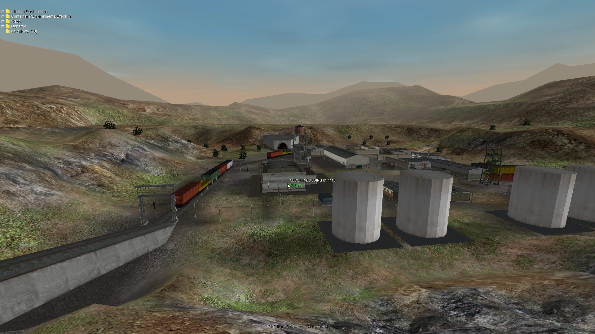
*3D viewport showing level models, objects, and real-time navigation.*

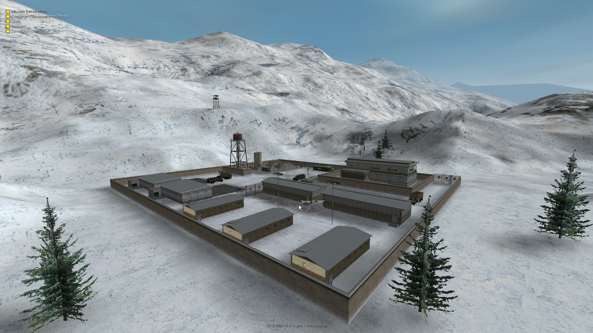
*Level 8 Harbor terrain, dynamic structures, and Flight Camera visualization.*

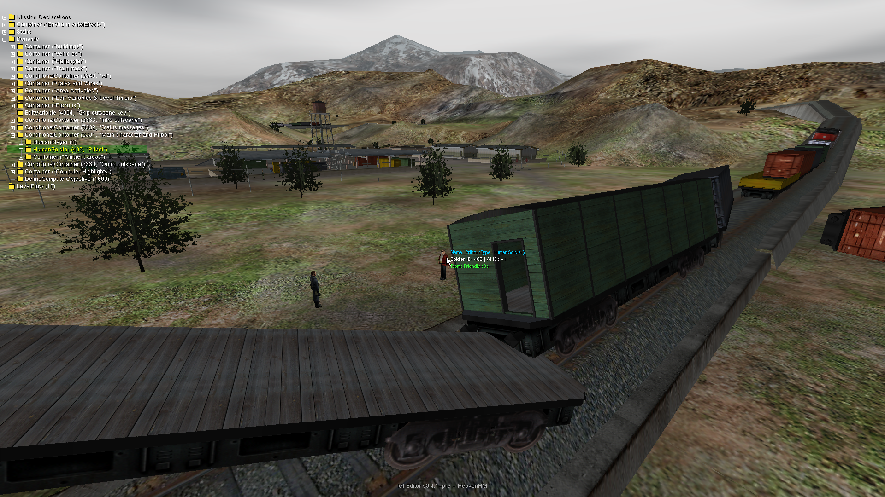
*Level 10 Research Facility rendering, building placement, and real-time snapping.*

### 🌳 Task & Objective Editor

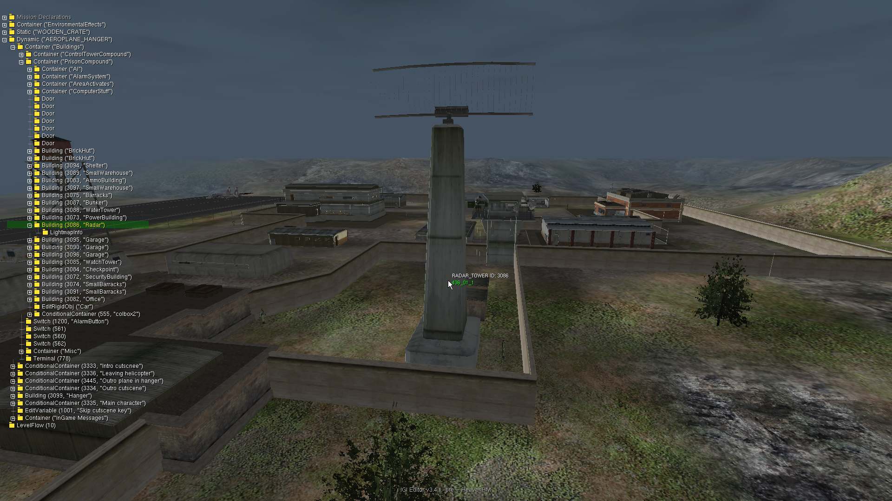
*Visual Task Tree Editor for mission objective management.*

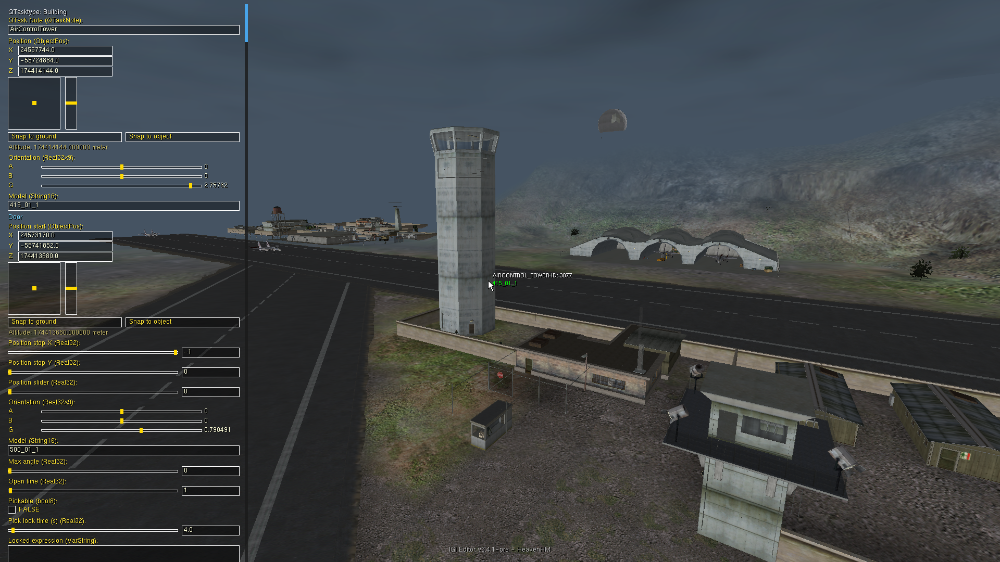
*Interactive Task Objective Editor modal for inline task renaming, notes updates, and direct live save/reload functionality.*

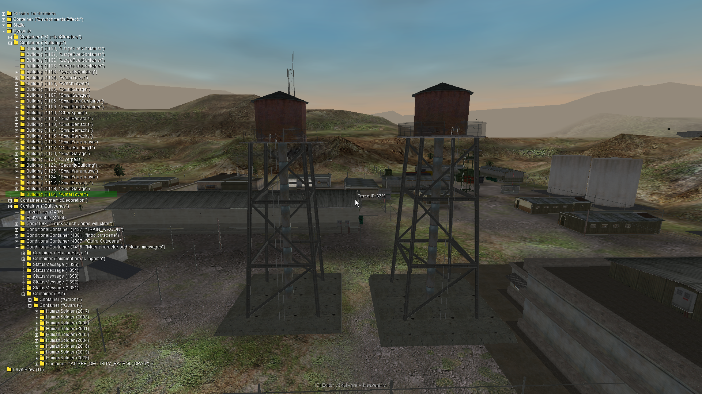
*Task Copy & Paste feature where you can copy and paste any task to replicate any objects with its object tree.*

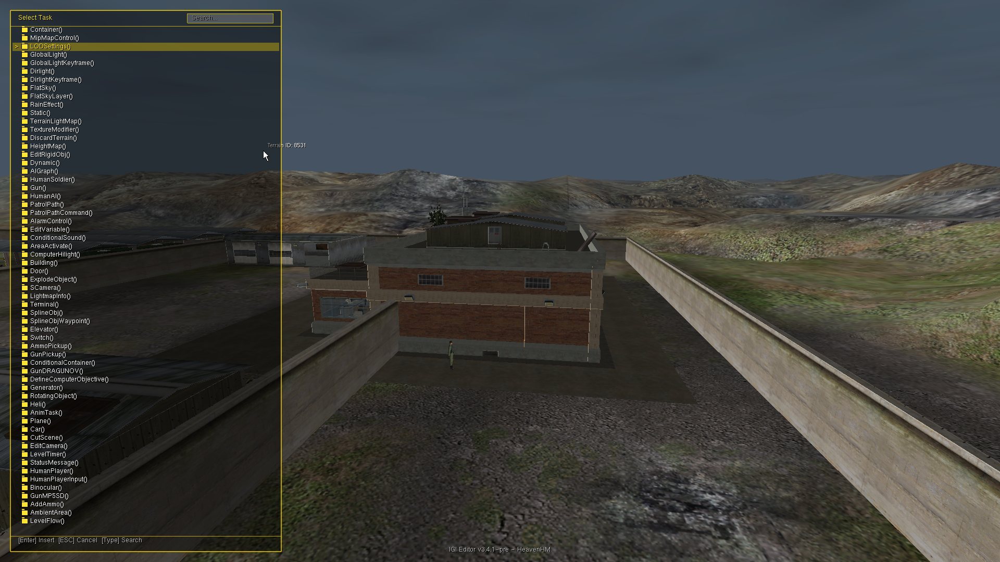
*Adding a new task allows you to easily inject custom new Objects, Buildings, or AI units directly into the level.*

### 🏔️ Terrain Editor

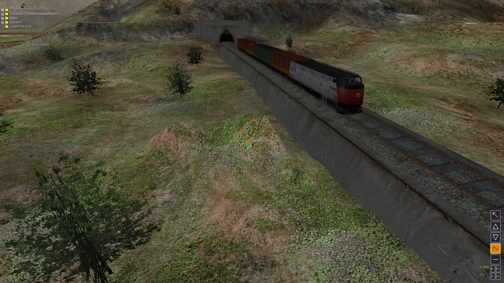
*Interactive 3D Terrain Editor showing terrain sculpting, heightmap editing, and active wireframe brush.*

### 📦 Object & Controls Editor

 </br>
*HUD telemetry displaying precise translation, rotation, and selection info.*

### 🤖 AI Editor

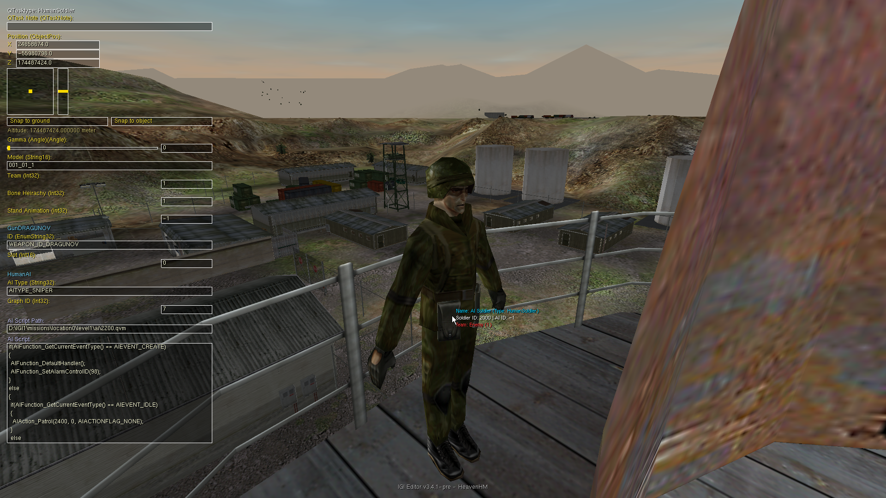
*AI Unit identification and management interface.*

### ⚙️ Debugging & Compilation

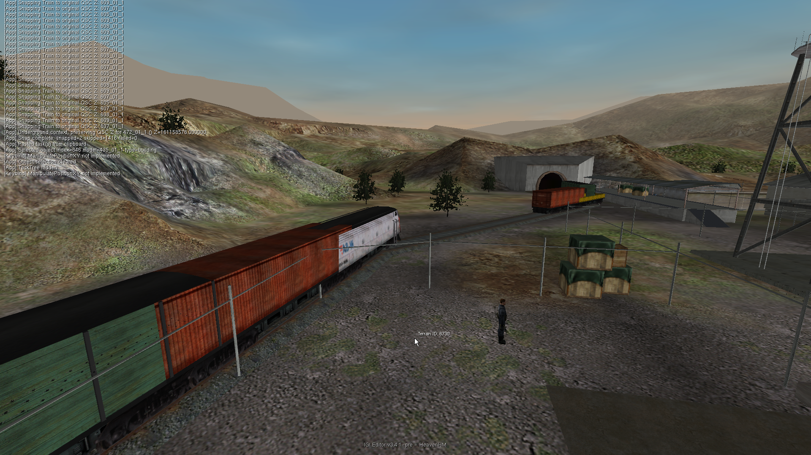
*Debug Console showing IGIPath resolution and QVM compilation pipeline.*

---

> **Tip:** This editor was tested on **Project IGI Neonix Remastered** ([Nexus Mods Link](https://www.nexusmods.com/projectigi/mods/5)) and it is highly recommended to use that mod alongside this editor for HD Textures, Terrain, and enhanced Gameplay.
> 
> 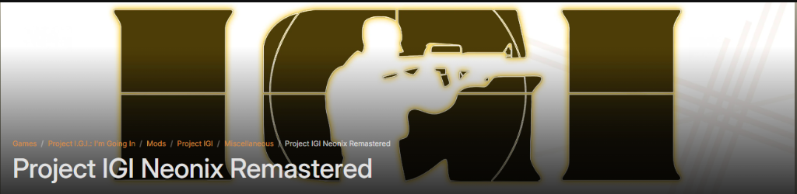

---


## 🚀 Features

- **3D Terrain Rendering & Sculpting**: Fully rendered real-time 3D terrain with active snapping, grid drawing, and heightmap editing brushes.
- **Flight Camera & 3D Navigation**: Full 6-DOF fly cam with fine-grained pageup/pagedown speed controls and teleportation tools.
- **Visual Task Tree Editor**: Visual tree-view workspace for managing mission objectives, inserting new tasks (`Task_New`), duplicating nodes, copying/pasting selections, deleting nodes, and multi-step **Undo/Redo** support.
- **Advanced Splines & Waypoints**: Complete spline system for procedural railway paths, mesh repeats, linear/curved segment configuration, and pathing lines.
- **AI Behavior & Mission Layout**: Edit NPC soldier structures, patrol nodes, and AI scripts — featuring a full inline AI Script Editor with scrolling, arrow-key navigation, and compile-on-save directly inside the property panel.
- **Inline AI Script Editor**: Select any HumanSoldier/HumanAI task to reveal a mini-notepad QSC editor with decompiled script preview, vertical scrolling, cursor navigation, autocomplete support, and automatic `.qvm` recompilation on save.
- **Live Editor Real-Time Sync**: Direct communication between the editor and the IGI engine for instant visual and physical feedback.
- **3D Object Placement & Manipulation**: Advanced 6-DOF controls for placing buildings, props, terminals, doors, cameras, and actors.
- **IGI 2 Style Controls**: Seamless object translation and rotation using standard mouse-drag modifiers (Shift, Ctrl, A, B, G).
- **Automated Path & Sync Pipeline**: Automatically handles compiler syncing, path mapping, and safe directory cleaning.
- **Foreign Model Support**: Ability to load, import, and add foreign models from other levels directly into the active level workspace.

### Current Testing Status
- **Building Editor**: Working - fully tested with Building objects.
- **Terrain Editor**: Working - 3D terrain heightmap rendering and snapping fully functional.
- **Task Tree & Objectives**: Working - interactive tree management, copy/paste, deletion, and insertion of new tasks fully operational.
- **AI & Waypoint System**: Working - full editing of NPC patrol nodes and properties.
- **Model Format**: Uses proprietary **Native MEF Models** natively loaded by the integrated MEF parser for optimal accuracy and parity with the game engine.
- **Level Tested**: Supports compiling/decompiling all 14 original game levels. Note that only the first few levels are fully tested and verified. Levels from Level 5 onwards may have bugs or issues; if you find any, please create an issue on GitHub and report them to us! Thank you!

### ⚠️ Known Issues
A comprehensive list of all known rendering, game, and engine issues can be found in our **[Known Issues Guide](docs/KNOWN_ISSUES.md)**.

---

## 🔄 How It Works

### Editor Flow
* **Sync & Decompile**: Copies terrain and compiles/decompiles `QSC`/`QVM` files dynamically to keep level data in sync.
* **Attachments (ATTA)**: If modifying attachments, decompiles/recompiles `MEF` files back to `.RES` to show changes.
* **Asset Loading**: Loads icons, textures, and sprites from `qed` and level directories.
* **Level Setup**: Parses QSC data, snaps MEF 3D models to the terrain heightmap, and positions the camera.
* **Auto-Backup**: Automatically creates file backups on save if `backup = true` in config.

---


## 💻 Getting Started

### Prerequisites
- **OS**: Windows (x86)
- **Compiler**: MSVC (Visual Studio 2022 recommended)
- **Build System**: CMake
- **IGI Game**: Full installation of Project IGI required for level data and assets

### Build Instructions
1. Clone the repository.
2. Open the directory in a terminal.
3. Run the following commands to build for **32-bit (Win32)**:
   ```powershell
   # Clean previous build if necessary
   if (Test-Path build) { Remove-Item build -Recurse -Force }
   
   # Configure for 32-bit (Win32) using a specific Visual Studio instance
   cmake -B build -G "Visual Studio 17 2022" -A Win32 -DCMAKE_GENERATOR_INSTANCE="C:/Program Files/Microsoft Visual Studio/2022/Community"
   
   # Build in Release mode
   cmake --build build --config Release
   ```
4. Launch the editor:
   ```powershell
   .\bin\Release\igi1ed.exe -level 1 -draw_parts 49 -stick_to_ground
   ```

#### 🎨 Selective Loading and Drawing (`-draw_parts` Bitmask)
You can customize what parts of the level to load and render using the `-draw_parts` bitmask argument:

* **Only Buildings with Terrain** (Bitmask: `17` = `1` Terrain + `16` Buildings)
  ```powershell
  .\igi1ed.exe -level 1 -draw_parts 17 -stick_to_ground
  ```
* **Only Objects/Props with Terrain** (Bitmask: `33` = `1` Terrain + `32` Objects/Props)
  ```powershell
  .\igi1ed.exe -level 1 -draw_parts 33 -stick_to_ground
  ```
* **Only AI Units with Terrain** (Bitmask: `65` = `1` Terrain + `64` AI)
  ```powershell
  .\igi1ed.exe -level 1 -draw_parts 65 -stick_to_ground
  ```
  *(Note: AI models are stored as non-building objects (props) inside the engine. To visually render the 3D meshes of the AI units, combine with props to get `-draw_parts 97` which is `1` + `32` + `64`)*

---

## 🕹️ CLI & GUI Command-Line Options

The **IGI Editor** can be run as both a fully featured interactive 3D graphical suite and a high-performance, headless command-line asset tool:

*   **GUI Editor Mode**: Launch the graphical user interface to edit level data. Supports options like `-level <num>` (1-14), custom dimensions (`-w`, `-h`), ground snapping (`-stick_to_ground`), and selective rendering bitmasks (`-draw_parts`).
*   **Headless CLI Mode**: Perform high-speed operations directly from your terminal. Parsers are provided for 3D meshes (`--mef`), script compiles (`--qsc`), reverse engineering bytecode (`--qvm`), extracting resource libraries (`--res`), textures (`--mtp`, `--tex`), navigation systems (`--graph`), terrain geometries (`--terrain`), database archives (`--dat`), and automated level integrations (`--verify-level`).

For a comprehensive list of all CLI commands, export options, selective rendering bitmask combinations, keyboard hotkeys, and hands-on examples, please check our detailed guide:
👉 **[CLI & GUI Reference Guide](docs/CLI.md)**

And for detailed information about file formats of IGI game 👉 **[IGI File Formats](docs/file-formats.md)**

---

## ⌨️ Controls

### Object Manipulation (IGI 2 Style)

Select an object and use **LMB Drag** + Modifiers:

| Modifier / Key | Action |
| :--- | :--- |
| **Shift** | Move on XY Plane |
| **Ctrl** | Move on XZ Plane |
| **A / B / G** | Rotate Alpha / Beta / Gamma axes |
| **S** | Snap to Ground |
| **Space** | Reset Orientation |
| **F11** | Teleport camera to selected object instead |

---

## 🧪 Unit Testing & Level Verification

`igi_tests.exe` is a standalone **GoogleTest** binary covering all core parsers, utilities, QVM round-trips, and level verification. It runs co-located with `igi1ed.exe` and the game files — no source tree needed at runtime.

```powershell
# Fast run — level 1 only (~18 seconds)
$env:IGI_TEST_LEVEL="1"; .\igi_tests.exe

# Run for a specific level
$env:IGI_TEST_LEVEL="10"; .\igi_tests.exe

# Run all 14 levels (~4 minutes)
.\igi_tests.exe
```

**230 tests** across 18 suites: QSC lexer/parser, QVM round-trips (synthetic + real game data for all 14 levels), file-format parsers (DAT, RES, TEX, MTP, FNT, Graph), verify-core units, and level-verification integration tests.

For the full test reference — suites, filters, fixture descriptions, and build/deploy instructions — see:
👉 **[Test Suite Documentation](docs/TESTS.md)**

---

## 🛠️ Future Roadmap

With the successful release of **Version 2.0.0**, core features like the **Native MEF Parser**, **Asset Extractor**, **QVM Toolchain**, **Task Tree Editor**, **Train & Spline Engine**, **Click-to-Select Map View**, and **Headless CLI** have been fully realized. Future milestones include:
- **Native Game Converter tool**: `igi1conv` — a standalone game asset converter matching `gconv.exe` from the IGI 2 Editor — developed in its own repo at [project-igi-conv](https://github.com/jones-hm/project-igi-conv). It ships as a **Qt application** with both a GUI mode and a headless CLI mode; the editor uses only the CLI. The full prebuilt package (exe + Qt runtime DLLs) is bundled at `editor/tools/igi1conv/`.
- **Upgraded compatibility**: A better upgraded version to support the Neo Remastered mod.
- **Visual 3D Graph Editor (Coming Soon)**: A full-featured Visual 3D Graph Editor displaying interactive nodes and visuals to seamlessly construct game logic, path routes, and area connections.
- **Weapon & Item Configurator**: Rich telemetry overlays and visual UI for modifying active gun parameters, ammunition slots, and dropping custom inventory directly onto the battlefield.
- **Full 14 Levels campaign run**: Complete, verified playthroughs of all custom compiled maps to guarantee total end-to-end stability.

---

## 🏆 Credits and Contributors

Credits and contributions of the people in this project:

- **[Artiom](https://github.com/NEWME0)** 👑 - **Game file formats** (*models, textures, animations*) and his **game conversion tools**. (**Huge Help!** )

- **[GM123](https://www.youtube.com/@gm1233)** 👑 - **Game Models & Animations** (*MEF / IFF formats*) and **development tools**. (**Huge Help!**)

- **[Neo](https://next.nexusmods.com/profile/xaeroneo?gameId=5664)** 👑 - **Guiding & testing** this project to match the *IGI 2 Editor style*. (**Huge Help!**)

- [hjcminus](https://github.com/hjcminus) - **Terrain Editor** Project, which this project is based on.

- **[Ferit](https://www.youtube.com/channel/UCpn_gZMkFVBUAe9SJK9hYQA)** 🌟 - **Game MEF/TEX file formats** and *IGI 2 style file formats* understanding.

- **[Dark](https://www.youtube.com/@CRONOQUILLOFFICIAL)** 🌟 - **Early prototype building**, *testing tools*, and **editor features**.

- **[Dimon](https://vk.com/dimonkrevedko)** 🌟 - **Graphs & Nodes** and his early [igi1-editor](https://vk.com/wall-275359_6439) *prototype project used for inspiration*.

- **[Yoejin](https://vk.com/id436486682)** 🌟 - **MTP & Models** *structure and information*.

- **[ORWA](https://www.youtube.com/@totalwartimelapses6359)** 🌟 - **Graphs Area and Nodes** *information and testing*.

  


### **Historical Note on Early Prototype:**
> There was an early prototype in year *2020* as a level editor for Project IGI created by **Dimon** which served as an initial inspiration for this project. Although it featured impressive 3D scene loading, it was never released to the public. The developer later became busier with life and work commitments, eventually abandoning the project and choosing not to publish it. You can view the original teaser post [here on VK](https://vk.com/wall-275359_6439).
> 
> 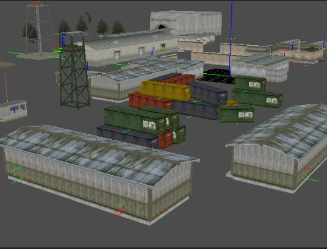

### 
---

## 📋 [Changelogs](CHANGELOGS.md)

See the [CHANGELOGS.md](CHANGELOGS.md) for version history and detailed change logs.

---

## Folder Structure

### Local Repository Folders
- **`shaders/`**: Core OpenGL GLSL shader source files
- **`bin/`**: Pre-compiled binaries and required dynamic libraries (DLLs)
- **`assets/`**: Editor assets (icons, screenshots in `assets/screenshots/`)

---

## 📞 Connect with us

If you encounter any issues or have suggestions, feel free to reach out:

- **🎮 Discord**: Message me at `Jones_IGI#3954` or join our [Discord Server](https://discord.com/invite/QpbQrRFAER).
- **📧 Email**: [igiproz.hm@gmail.com](mailto:igiproz.hm@gmail.com).
- **🌟 GitHub**: Follow the project on [Jones-HM GitHub](https://github.com/Jones-HM/).
- **📺 YouTube**: Subscribe to [IGI Research Devs](https://www.youtube.com/@igi-research-devs) for guides and walkthroughs.

## Author
Written and maintained by **Heaven-HM**.
